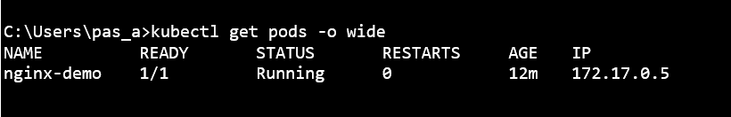

¿Cómo puedo obtener las últimas 10 líneas de la salida estándar (logs generados por la aplicación)?

  ```kubectl logs --tail=10 nginx-server```

¿Cómo podría obtener la IP interna del pod? Aporta capturas para indicar el proceso que seguirías.

```kubectl get pods -o wide```



```kubectl describe pod nginx-server```

Imagen2

 ¿Qué comando utilizarías para entrar dentro del pod?

 ```kubectl exec -it nginx-server -- sh```

Necesitas visualizar el contenido que expone NGINX, ¿qué acciones 
debes llevar a cabo?

```kubectl port-forward pod/nginx-server 80->84:80```

Imagen3

Indica la calidad de servicio (QoS) establecida en el pod que acabas de 
crear. ¿Qué lo has mirado?

```kubectl kubectl describe pod nginx-server ```

Imagen4

Que la calidad del  (QoS) servicio esta Guarenteed
