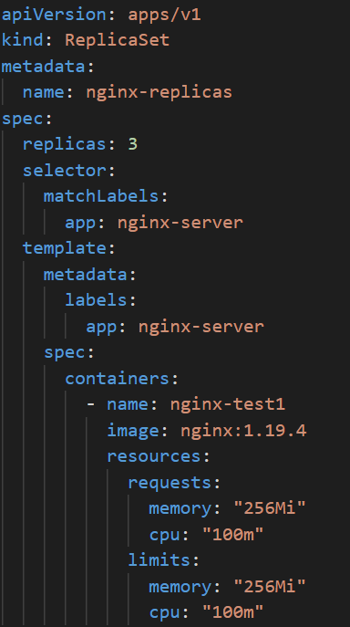
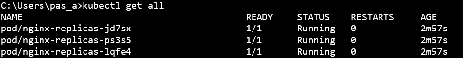
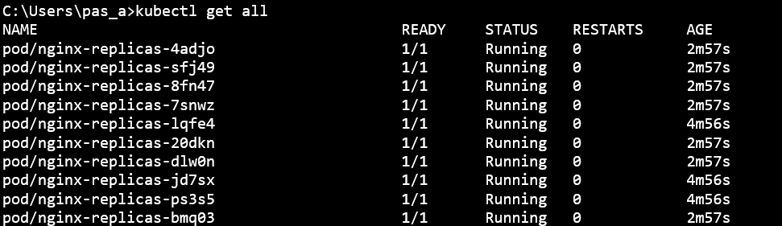

Debe tener 3 replicas





¿Cúal sería el comando que utilizarías para escalar el número de replicas a 10?

```csharp kubectl scale --replicas=10 -f replicas.yml```


Si necesito tener una replica en cada uno de los nodos de Kubernetes, 
¿qué objeto se adaptaría mejor?

DaemonSet